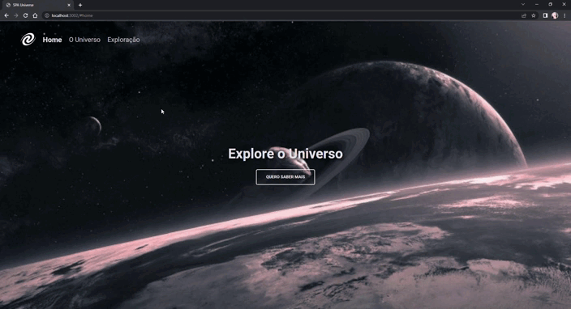

<h1 align="center">SPA Universe </h1>

Projeto SPA (Single Page Application) construído para exercitar conceitos sobre:

<ul>
  <li>SPA (Single page Application</li>
  <li>Assincronismo e promises</li>
  <li>Class e Orientação a objetos.</li>
  <li>Mapeamento de rotas</li>
</ul>

## 🚀 Tecnologias

Esse projeto foi desenvolvido com as seguintes tecnologias:

- HTML e CSS
- JavaScript
- Git e Github
- Figma

## 💻 Projeto

O Habits é um app para ajudar a rastrear os hábitos.

- [Visite o projeto online](https://myllenaff.github.io/SPA_Universe)